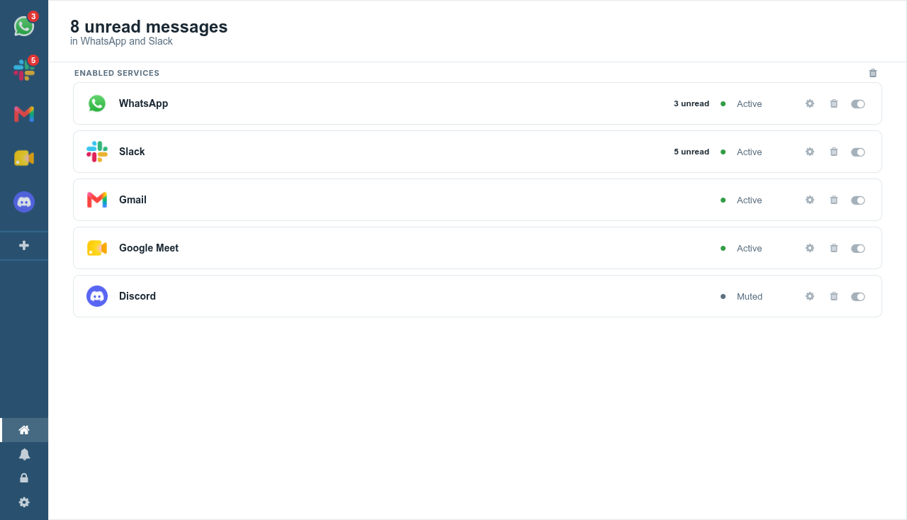

<div align="center">
  
  <h1>Redil</h1>
  <p>One window for the messaging and email apps you already use in the browser.</p>
  <p><a href="https://www.gnu.org/licenses/gpl-3.0.en.html">GNU GPL v3</a></p>
</div>



---

This is a maintained fork of [Rambox Community Edition](https://github.com/ramboxapp/community-edition), which its authors archived in 2022 and pointed at their commercial product. The code was left unbuildable: the renderer was compiled by a version of Sencha Cmd that is no longer distributed, and the generated file it produced was never committed.

That is fixed. The app builds and runs from this repository with nothing but npm.

## What changed since upstream

- **Electron 13 to 44.** The renderer was moved off three APIs Electron has since removed: the `remote` module, the `new-window` event, and `desktopCapturer` in the renderer.
- **Builds without Sencha Cmd.** `scripts/gen-bootstrap.js` boots the app from the Ext JS build and theme CSS already vendored in the repository.
- **Packaging rebuilt** on electron-builder, straight from the repository, with no dependency on the archived artifact repo that upstream's CI cloned.
- **Service permissions are refused by default.** The old handler granted camera, microphone and location to every loaded service without asking. Sensitive permissions now prompt once per service.
- **A third-party tracker and a hardcoded API key** were removed from the renderer, along with the dead Auth0 sign-in and profile sync, which pointed at infrastructure this fork cannot use.
- **The catalogue is maintained here.** Thirteen entries pointed at services that no longer exist. `npm run check:services` reports what has rotted.
- **The interface was refreshed**, lightly, without changing the layout.

## Install

Builds are produced for Linux as an AppImage, a deb and a tarball. See [Releases](https://github.com/lukasborges/rambox-ce/releases).

The AppImage needs FUSE 2, which some distributions no longer install by default. On Fedora that is `fuse-libs`; on Debian and Ubuntu, `libfuse2`. Without it, run the AppImage with `--appimage-extract-and-run`.

Windows and macOS are configured but have not been built or tested by this fork.

## Run from source

```bash
npm install
npm run bootstrap     # writes bootstrap.js, which is not committed
npm start
```

On Linux, `npm start` may abort with a fatal GPU error, because the Electron installed by npm ships its sandbox helper without the setuid bit. Start it with `--no-sandbox`, which is what the packaged Linux builds already do.

```bash
npm run build:linux     # AppImage, deb and tar.gz into dist/
npm run check:services  # report catalogue entries whose URLs have rotted
```

`CLAUDE.md` documents the architecture, the build, and the parts of this codebase that behave in ways you would not guess from reading them.

## Privacy

No account is needed and none is offered. The app stores nothing remotely: your list of services lives in the renderer's local storage, and each service keeps its own session in a persistent Electron partition, so you stay signed in between launches until you remove the service.

Sessions belong to the services themselves. Redil is a frame around their web apps and does not see inside them.

## Contributing

Work on a branch, never on `main`, and see [CONTRIBUTING.md](./CONTRIBUTING.md). The prerequisites listed there are out of date: Sencha Cmd and Ruby are no longer needed.

Translations come from Crowdin and are generated into `resources/languages`. The download path needs migrating to Crowdin's current API client; the version pinned here predates modern Node.

## Disclosure

Redil is not affiliated with any of the messaging services it opens, nor with Rambox LLC or its product.

## Licence

[GNU GPL v3](./LICENSE). Ext JS 5.1.1 is vendored under the same licence.
