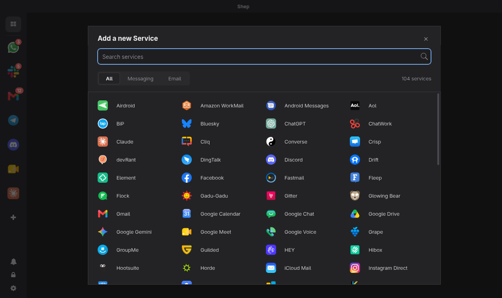

<div align="center">
  
  <h1>Shep</h1>
  <p>One window for the messaging and email apps you already use in the browser.</p>
  <p><a href="https://www.gnu.org/licenses/gpl-3.0.en.html">GNU GPL v3</a></p>
</div>

<p align="center">
  
  
</p>

---

This is a maintained fork of [Rambox Community Edition](https://github.com/ramboxapp/community-edition), which its authors archived in 2022 and pointed at their commercial product. The code was left unbuildable: the renderer was compiled by a version of Sencha Cmd that is no longer distributed, and the generated file it produced was never committed.

That is fixed. The app builds and runs from this repository with nothing but npm.

## What changed since upstream

- **Electron 13 to 44.** The renderer was moved off three APIs Electron has since removed: the `remote` module, the `new-window` event, and `desktopCapturer` in the renderer.
- **Builds without Sencha Cmd.** `scripts/gen-bootstrap.js` boots the app from the Ext JS build and theme CSS already vendored here. The Sencha workspace, the build files and the Sass that only that toolchain could read are gone.
- **The renderer is isolated.** `contextIsolation` is on and `nodeIntegration` off; the page reaches the main process through a single preload with a closed list of channels. Service pages are isolated and sandboxed with it, because Electron will not let a guest be less isolated than the window hosting it.
- **Packaging rebuilt** on electron-builder, straight from the repository, with no dependency on the archived artifact repo that upstream's CI cloned.
- **Service permissions are refused by default.** The old handler granted camera, microphone and location to every service that asked. Camera, microphone and screen capture are now answered once per service and the answer is kept — except for the apps whose purpose is calls, which the catalogue marks and the service's own settings can change.
- **A third-party tracker and a hardcoded API key** were removed from the renderer, along with the dead Auth0 sign-in and profile sync, which pointed at infrastructure this fork cannot use.
- **The catalogue is maintained here.** Seven entries pointed at services that no longer answer and were dropped; ten were added, among them Google Meet, Zoom, ChatGPT, Claude and Bluesky. `npm run check:services` reports what has rotted.
- **A new interface.** Services sit in a rail of icons down the left, and everything done to one is on its right click; a title bar of the app's own carries the page's back, forward and reload; workspaces group services and switch from the top of the rail; adding a service is an overlay behind the `+`; preferences are five sections instead of one scroll of fourteen controls; and a dark theme follows the desktop.
- **A mark of its own**, drawn to the GNOME app icon guidelines: a border collie puppy on the template's square, in Adwaita blue, with a monochrome tray icon on Linux. `npm run icons` renders every PNG and ICO in the tree from the SVGs in `resources/logo`.
- **Tests and a linter.** A Playwright suite launches the real app and drives it; `npm test` runs ESLint first.

## Install

[Releases](https://github.com/lukasborges/shep/releases) carry a Linux AppImage. `npm run build:linux` also makes a deb and a tarball.

Shep was briefly called Redil. Quit Redil before the first launch of Shep: that launch moves `~/.config/Redil` to `~/.config/Shep`, with your services, sign-ins and preferences.

The AppImage needs FUSE 2, which some distributions no longer install by default. On Fedora that is `fuse-libs`; on Debian and Ubuntu, `libfuse2`. Without it, run the AppImage with `--appimage-extract-and-run`.

Windows and macOS are configured but have not been built or tested by this fork.

## Run from source

```bash
npm install
npm run bootstrap     # writes bootstrap.js, which is not committed
npm start
```

On Linux, `npm start` may abort with a fatal GPU error, because the Electron installed by npm ships its sandbox helper without the setuid bit. Start it with `--no-sandbox`, which is what the packaged Linux builds already do.

```bash
npm test                # ESLint, then the Playwright suite
npm run build:linux     # AppImage, deb and tar.gz into dist/
npm run check:services  # report catalogue entries whose URLs have rotted
```

`CLAUDE.md` documents the architecture, the build, and the parts of this codebase that behave in ways you would not guess from reading them.

## Privacy

No account is needed and none is offered. The app stores nothing remotely: your list of services lives in the renderer's local storage, and each service keeps its own session in a persistent Electron partition, so you stay signed in between launches until you remove the service.

Sessions belong to the services themselves. Shep is a frame around their web apps and does not see inside them.

## Contributing

This fork has one maintainer, who commits to `main`. Contributions are welcome as pull requests from a branch; [CONTRIBUTING.md](./CONTRIBUTING.md) is upstream's and still describes how to write one, except for its prerequisites: Sencha Cmd and Ruby are no longer needed.

Translations live generated in `resources/languages`. The download half of that pipeline is gone — it called a Crowdin API version that now answers 301, through a client that no longer loads on a modern Node, against a project this fork does not own. Until there is a Crowdin project for Shep, those generated files are the only source there is, and strings added since ship in English.

## Disclosure

Shep is not affiliated with any of the messaging services it opens, nor with Rambox LLC or its product.

## Licence

[GNU GPL v3](./LICENSE). Ext JS 5.1.1 is vendored under the same licence.
