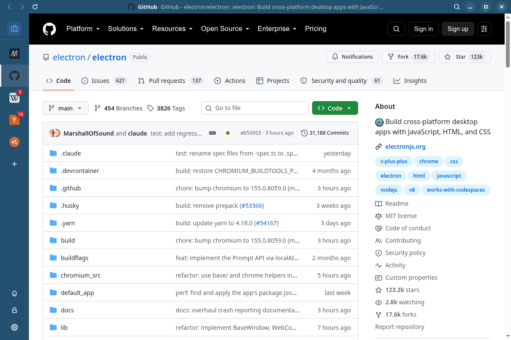
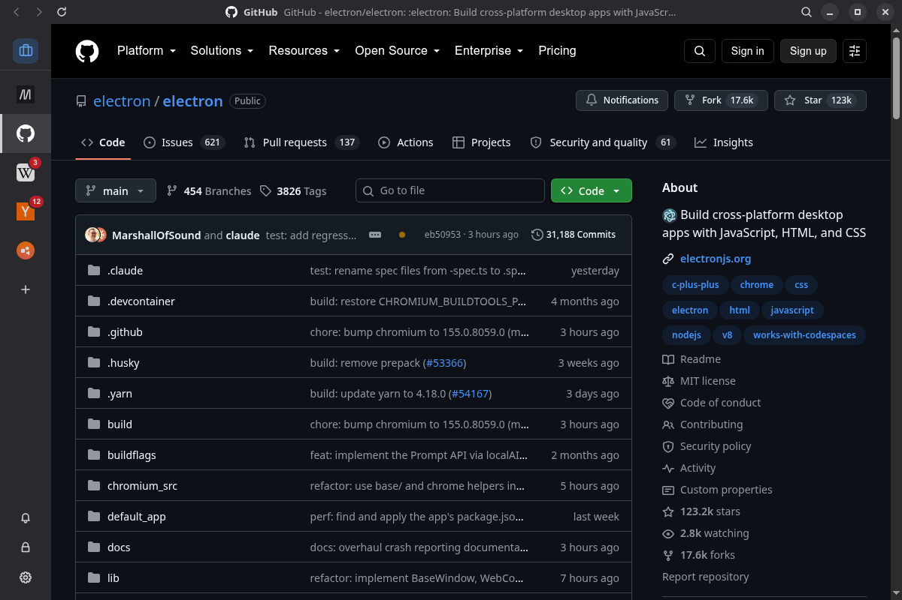

<div align="center">
  
  <h1>Shep</h1>
  <p>One window for the web apps you already use in the browser.</p>
</div>

<p align="center">
  
  
</p>

Shep keeps WhatsApp, Gmail, Slack, Teams, Claude or anything else with a web address in a rail down the left of one window, each signed in on its own, each counting what is unread. It is made for Linux and for GNOME in particular: the icon, the palette and the dialogs follow GNOME's guidelines, and the window follows the desktop's light or dark style.

## How it works

There is no catalogue to pick from. Press `+`, type the address, and that is the service.

- **Every service works the same way.** Nothing in Shep knows one site from another, so there are no per-service scripts to go stale when a site changes.
- **The icon is the page's favicon**, as the page itself shows it. A service that marks news by changing its favicon, like Google Chat, shows it in the rail that way.
- **The unread count comes from the page title**, the `(3)` most web apps put in front of it. A title that says there is something without a number, `(•)`, draws a dot.
- **Links stay in the app.** A link to another site opens in a window of Shep's that shares the service's session, so it is already signed in. When a sign-in there finishes back on the service, the window closes and the service carries on. Open Link in Browser is on the right click.
- **Pages see a browser**: the Chromium Shep is built on, with nothing of Shep or Electron in its user agent, which is what sign-ins and captchas check for.
- **Everything done to a service is on its right click**: back and forward, zoom, notifications, sound, disable, edit, move to a workspace, remove.

Services can be grouped into **workspaces**, one on screen at a time, switched from the top of the rail. The ones out of sight keep running, counting and notifying, and the switcher shows a dot when one of them has something new.

Shep also has a do-not-disturb switch, a lock screen with a password, an icon in the top bar, spell checking, screen sharing through the desktop's own picker on Wayland, find in page, and a report of what each service's title says, for when a count looks wrong. It speaks English, Portuguese, Spanish, French, German, Italian, Russian, Japanese, Chinese and Korean.

## Install

[Releases](https://github.com/lukasborges/shep/releases) carry an AppImage, a deb and a tarball for x86-64 Linux. Shep updates itself from those releases.

The AppImage needs FUSE 2, which some distributions no longer install by default: `fuse-libs` on Fedora, `libfuse2t64` on Ubuntu 24.04 and later, `libfuse2` on Debian. Without it, run the AppImage with `--appimage-extract-and-run`.

Shep 1.0 is a new app and starts from a clean profile. Services added in 0.10 have to be added again.

## Keyboard

| Keys | |
|---|---|
| `Ctrl+1` … `Ctrl+9` | The first nine services in the rail |
| `Ctrl+Tab`, `Ctrl+Shift+Tab` | The next and the previous service |
| `Ctrl+Alt+1` … `Ctrl+Alt+9` | A workspace, the number after the last being all services |
| `Alt+←`, `Alt+→` | Back and forward in the page |
| `Ctrl+R`, `F5` | Reload, and `Ctrl+Shift+R` without the cache |
| `Ctrl+F` | Find in page |
| `Ctrl+=`, `Ctrl+-`, `Ctrl+0` | Zoom in, out, back to actual size |
| `Ctrl+N` | Add a service |
| `Ctrl+,` | Preferences |
| `Alt+Shift+D` | Do not disturb |
| `Alt+Shift+L` | Lock |
| `F11` | Full screen |
| `Ctrl+Q` | Quit |

## Privacy

There is no account and no server. Shep keeps your services, workspaces and preferences in `~/.config/Shep/shep.json`, and each service keeps its own session beside it, so you stay signed in until you remove the service, which deletes its session too.

Shep sends nothing about you anywhere. It makes two requests of its own: the update check, to this repository's releases on GitHub, and the download of a spell-checking dictionary the first time a language needs one, which Chromium fetches from Google. What each service does is up to the service: Shep is a frame around its web app and does not look inside.

Camera, microphone and screen sharing are asked about once per service and the answer is remembered. Notifications follow the service's own switch, and a few that expose nothing, such as going full screen, are granted. Every other permission a page asks for is refused.

The lock password is stored as a salted scrypt hash. The lock hides the window's contents; it does not encrypt the sessions on disk.

## Development

Node 22 or later and npm.

```bash
npm install
npm start               # the app, with the interface reloading as you edit
npm test                # typecheck, lint, build, unit tests, then the end-to-end suite
npm run package         # AppImage, deb and tarball into dist/
```

A run from the repository uses its own profile, `~/.config/Shep-dev`, and never touches the installed app's.

The end-to-end suite launches the real app, so it opens windows. With `xvfb-run` installed it opens them on a virtual display instead of your desktop; one test also needs `xdotool`. On Fedora that is `dnf install xorg-x11-server-Xvfb xdotool`. `npm run test:network` adds the tests that load real sites, such as the one that renders a Cloudflare captcha.

If Electron aborts at start with a sandbox error, as it does on Ubuntu 24.04, the distribution keeps unprivileged user namespaces from Chromium's sandbox. Pass `--no-sandbox`, which is what the packaged builds do.

See [CONTRIBUTING.md](./CONTRIBUTING.md) before sending a change.

## Credits

Shep began as a fork of [Rambox Community Edition](https://github.com/ramboxapp/community-edition), archived in 2022, and 1.0 is a rewrite that keeps its name and none of its code. The idea that every service should work the same way comes from [ElectronIM](https://github.com/manusa/electronim). The workspace icons are from [Lucide](https://lucide.dev).

Shep is not affiliated with any of the services it opens.

## Licence

[GNU GPL v3](./LICENSE).
